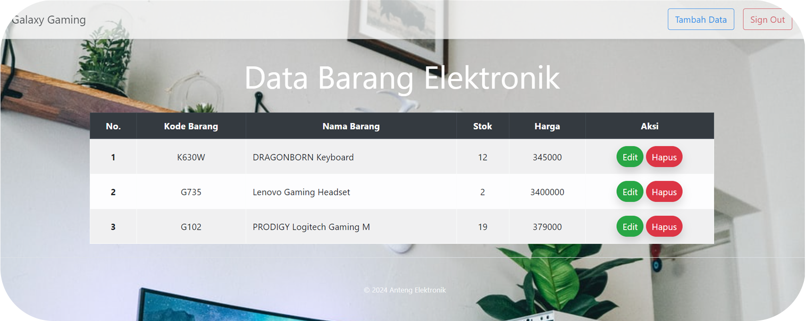

    

 

    

    Website Inventory ini dibangun menggunakan framework Codeigniter Versi 3.1.11.
    Website yang merupakan tugas dari praktikum LabTI ini dilengkapi dengan fitur login,
    user dibuat menggunakan hard code dengan fungsi password_hash agar password terenkripsi dengan aman.
    Website ini dilengkapi dengan fitur tambah, edit, dan hapus item/ barang.
    

    
Menggunakan PHP versi 5.4

 

    - `User Guide Codeigniter <https://codeigniter.com/docs>`\_
    - `Community Forums <http://forum.codeigniter.com/>`\_
    - `Community Slack Channel <https://codeigniterchat.slack.com>`\_
    - `Bootstrap Framework <https://getbootstrap.com/docs/4.6>`\_

